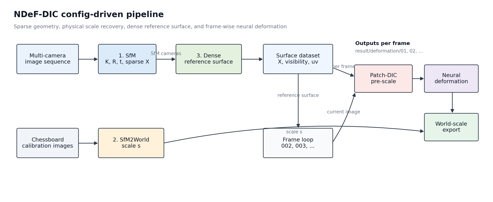
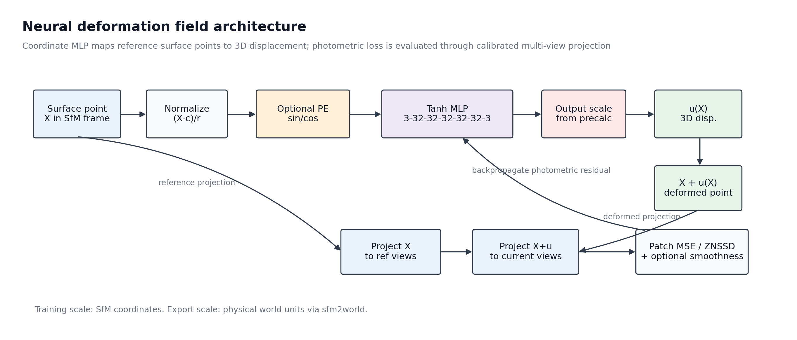
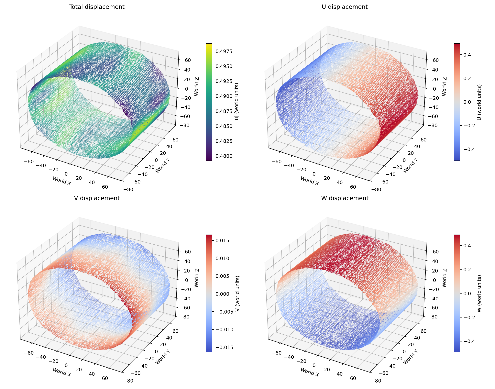
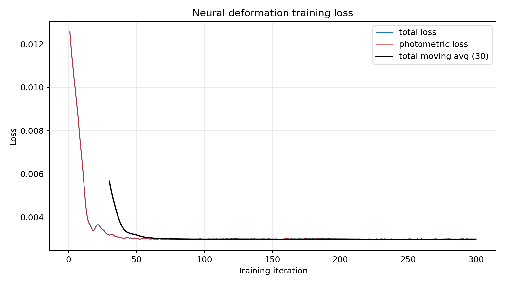
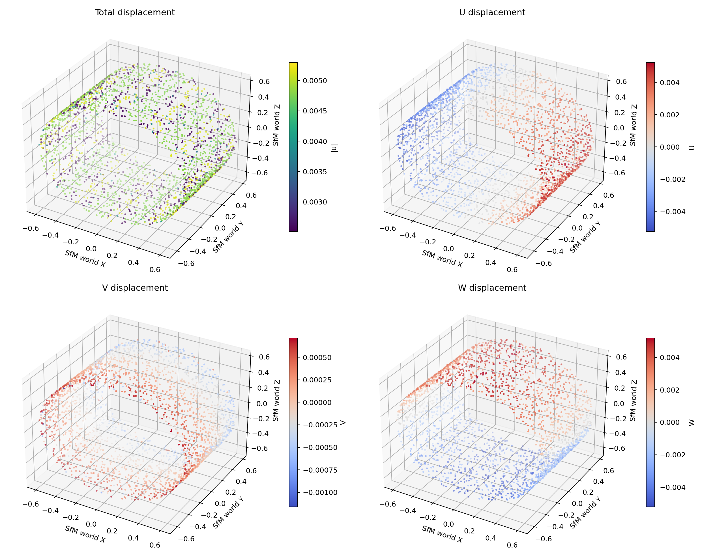
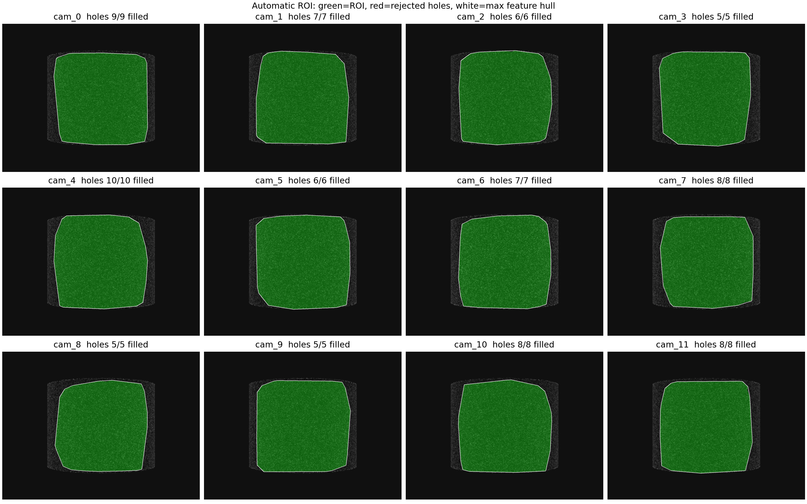

# NDeF-DIC

Neural Deformation Field for multi-camera digital image correlation.

NDeF-DIC estimates a continuous 3D displacement field from multi-view DIC images. The current pipeline combines reference SfM, chessboard-based physical scale recovery, dense reference-surface sampling, sparse displacement-scale pre-calculation, and photometric neural deformation optimization.

The project is intentionally config-driven. Case-specific paths and algorithm settings live in numbered YAML files under `configs/`, while `run.py` orchestrates the modules.

## Highlights

- Multi-camera reference SfM exports `K`, `R`, `t`, sparse points, observations, and visual diagnostics.
- `sfm2world` estimates physical scale from a fixed chessboard observed by visible cameras.
- Dense reconstruction produces a reference surface dataset with visibility, projected UV, and depth-consistency records.
- Deformation is solved frame by frame with a compact tanh MLP:
  `3 -> 32 -> 32 -> 32 -> 32 -> 32 -> 3`.
- Final deformation exports are converted from SfM scale to physical world scale, while SfM-scale arrays are retained for debugging.

## Environment

Recommended Python version: `3.10` to `3.12`.

Create an environment:

```powershell
conda create -n ndef-dic python=3.10 -y
conda activate ndef-dic
```

Install the package and dependencies:

```powershell
pip install -e .
```

For SfM with COLMAP bindings:

```powershell
pip install -e ".[colmap]"
```

If you prefer the requirements file:

```powershell
pip install -r requirements.txt
```

Core dependencies include `torch`, `numpy`, `scipy`, `opencv-python`, `matplotlib`, `imageio`, and `pyyaml`. `pycolmap` is required when running the SfM stage.

## Data Layout

Expected case structure:

```text
case/CylinderDIC/
  images/
    cam_0/
      001.bmp
      002.bmp
    cam_1/
      001.bmp
      002.bmp
    ...
  calibrate_images/
    cam_0/
      001.bmp
    cam_1/
      001.bmp
    ...
  result/
```

Image sequence convention:

- The first image in each camera folder is the reference image.
- All following images are deformation/current images.
- If `dense.auto_roi.enabled = false`, the last image is treated as a user mask instead of a deformation image.
- Each `calibrate_images/cam_x/` folder should contain one chessboard image.

## Configuration

Configuration files are stored in `configs/`:

```text
configs/
  1_project.yaml
  2_sfm.yaml
  3_dense.yaml
  4_sfm2world.yaml
  5_precalculation.yaml
  6_deformation.yaml
```

Path convention:

- `project.data_dir` is the case root.
- `project.result_dir` is the result root, relative to `project.data_dir` when not absolute.
- Module result paths are relative to `project.result_dir`.
- Raw image paths such as `image_dir` and `calibrate_image_dir` are relative to `project.data_dir`.

## Pipeline



Execution order:

1. `sfm`: self-calibrated sparse reconstruction from the reference image.
2. `sfm2world`: chessboard-based scale estimation from SfM units to physical units.
3. `dense`: ROI, depth initialization, ZNSSD depth refinement, dense reconstruction, and surface sampling.
4. Frame loop:
   - `precalculation`: sparse patch-DIC scale estimate for the current frame.
   - `deformation`: neural deformation-field training and world-scale export.

Frame outputs:

```text
result/deformation/precalculation/patch_dic_sparse/01/
result/deformation/01/
result/deformation/precalculation/patch_dic_sparse/02/
result/deformation/02/
...
```

## Network Architecture



The deformation model maps reference surface coordinates to 3D displacement:

```text
X_sfm -> normalize -> optional positional encoding -> tanh MLP -> u_sfm
X_def = X_sfm + u_sfm
```

Photometric supervision is evaluated by projecting `X_sfm` into reference images and `X_def` into current images over all visible cameras. The current implementation supports `mse` and `znssd` patch losses.

Default CylinderDIC deformation settings:

```yaml
network:
  hidden_dim: 32
  hidden_layers: 5
  activation: tanh
  use_positional_encoding: false

loss:
  photometric: mse
  patch_radius: 2   # 5x5 patch

training:
  epochs: 150
  lr: 0.003
  batch_size: 51172
```

## Usage

Run the complete configured pipeline:

```powershell
python run.py --stages all
```

Run selected stages:

```powershell
python run.py --stages sfm
python run.py --stages sfm2world
python run.py --stages dense
python run.py --stages deformation --frames 01
```

Use existing SfM products:

```powershell
python run.py --stages all --skip-sfm
```

Run specific deformation frames:

```powershell
python run.py --stages deformation --frames 01,02
```

Inspect command-line options:

```powershell
python run.py --help
```

## Current CylinderDIC Results

SfM-to-world scale from chessboard calibration:

```text
visible cameras: cam_0, cam_1, cam_2, cam_10, cam_11
selected pair:   cam_1, cam_11
scale:           115.711187573 physical units per SfM unit
mean reproj err: 0.1605 px
```

Frame `01` deformation result:

```text
best loss:          0.0029416410
mean |u|, SfM:      0.00423022
mean |u|, world:    0.48948386
max  |u|, world:    about 0.499
```

Result visualizations:









## Output Data

The per-frame deformation result is saved as:

```text
case/CylinderDIC/result/deformation/01/deformation_surface_result.npz
```

Important arrays:

```text
points                         world-scale 3D reference surface points
displacement                   world-scale 3D displacement
displacement_magnitude          world-scale displacement magnitude
points_sfm                     original SfM-scale points
displacement_sfm               original SfM-scale displacement
displacement_magnitude_sfm      original SfM-scale displacement magnitude
sfm2world_scale                 physical scale factor
cam_names                       camera names
```

## Research Notes

The current method should be interpreted as a surface-based neural DIC framework, not as a radiance-field renderer. The neural field represents displacement, while the image formation model is standard calibrated projection plus local DIC-style photometric residuals.

The strongest scientific assumptions are:

- The reference surface is sufficiently reconstructed by the dense module.
- Surface points have reliable multi-camera visibility.
- Lighting changes are mild enough for MSE, or local normalization is handled by ZNSSD.
- The chessboard-derived `sfm2world` scale is accurate enough to convert both geometry and displacement into physical units.

Future extensions can add multi-frame temporal regularization, strain-field post-processing, multi-view checkerboard bundle scale estimation, and physics-informed constraints.
