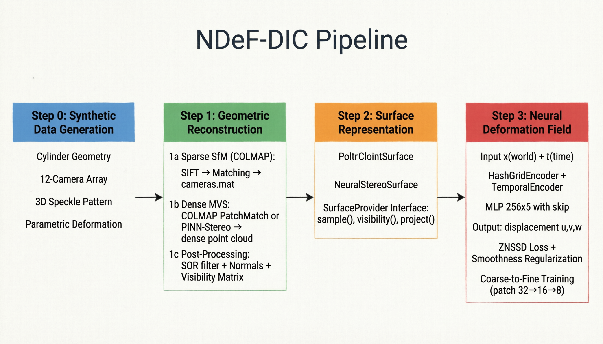
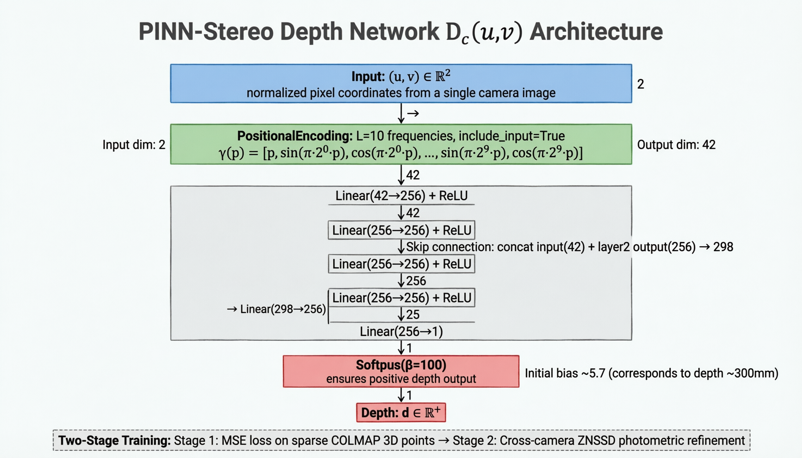
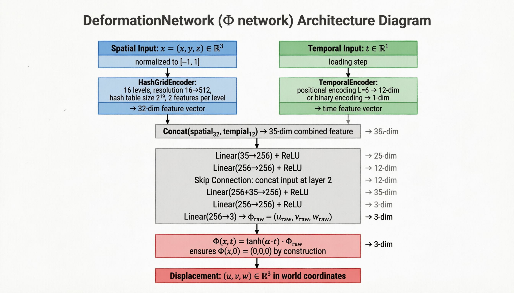

# NDF-DIC — Neural Deformation Field for Multi-View DIC

用神经隐式变形场直接从多目散斑图像中恢复连续 3D 位移场。

---

## 1. 核心思路

### 不是 NeRF，是 DIC

这个项目不渲染图像。它用一种连续隐式表示来替代传统 DIC 的逐像素相关匹配，直接求解 3D 位移场。

```
传统 DIC:   图像对 → 逐像素相关 → 2D/3D 位移
NDF-DIC:    多目图像 → Φ(x,t) → 投影 → 多目 ZNSSD → 连续 3D 位移场
```

### 为什么这么做

传统 DIC 有三个固有问题：

| 问题 | NDF-DIC 的方案 |
|------|---------------|
| **基于网格/子区** — 位移场在离散点上定义，难以表示裂纹和应变集中 | 使用 Frequency Encoding (PE) 或 Hash Grid Encoding，天然表示连续位移场 |
| **单相机/双目** — 依赖 patch 质量，遮挡区域无解 | 多目（12 相机）冗余 — 每个表面点被 6-7 个相机同时看到，遮挡不再致命 |
| **逐帧独立** — 无法利用时域连续性 | Φ(x,t) 自带时间维度，用一个网络表示全部加载步的位移场 |

### 为什么不用 NeRF 组件

Volume Rendering、Density Field、Radiance Field、Sphere Tracing 服务于图像合成，不服务于位移测量。引入它们只会增加计算成本，稀释 DIC 信号。

**借鉴 NeRF 的空间编码策略，但根据硬件选择最合适的方案**：
- **Frequency Encoding (PE)**：推荐默认。sin/cos 密集编码，参数少（~300K），GPU 快 32×，CPU 快 3.3×
- **HashGrid Encoding**：保留选项。高分辨率哈希表（17M 参数），适合需要极端高频细节的场景

### 核心创新

多目 ZNSSD 损失直接监督变形场，不经过渲染管线：

```
表面点 x → Φ(x,t) → x_def = x + φ
           ↓
project_to_camera(x, cam) → uv_ref    } 
project_to_camera(x_def, cam) → uv_def } 可微投影
           ↓
extract_patches(ref_img, uv_ref) → P_ref  }
extract_patches(def_img, uv_def) → P_def  } grid_sample
           ↓
ZNSSD(P_ref, P_def) → loss
           ↓
loss.backward() → 梯度经 project_to_camera 反传至 Φ 网络
```

整条梯度链没有断点——投影、patch 提取、ZNSSD 全部可微。

---

## 2. 项目架构

### 三阶段流水线



```
Step 1: Geometric Reconstruction（几何重建）
        COLMAP SfM → K,R,t + 稀疏点
        PatchMatch Stereo / PINN-Stereo → 稠密点云 / D_c 深度网络
        ↓
Step 2: SurfaceProvider（表面采样接口）
        sample_surface_points(M)   → (x, normals)
        get_visible_cameras(x)      → cam_ids
        project_to_camera(x, cam)   → uv（可微）
        ↓
Step 3: Neural Deformation Field（变形场训练）
        Φ(x,t): PE/HashGrid + MLP + tanh gate → (u,v,w)
        Coarse-to-fine: patch 32→16→8，λ_smooth 1e-2→1e-4
```

### Step 1 设计决策

优先使用 COLMAP 成熟模块。项目核心创新不在几何重建——除非确有必要，不要自己实现 MVS。

两个稠密重建路径：
- **PatchMatch**（推荐）：COLMAP 的标准稠密重建，精度高，需要 CUDA
- **PINN-Stereo**（实验性）：每相机一个隐式深度网络 D_c(u,v)，通过跨相机 ZNSSD 联合优化。精度不如 PatchMatch，但**完全可微**



### Step 2 设计决策

Step 2 的价值不在产生数据——而在**统一接口**。两种实现对 Step 3 完全透明：

| 实现 | 数据来源 | 采样方式 | 法向量 |
|------|---------|---------|--------|
| `PointCloudSurface` | Step 1 稠密点云 (.ply + .npy) | 随机索引查表 | PCA 估计 |
| `NeuralStereoSurface` | PINN-Stereo 的 D_c 网络 | 像素采样 → D_c → unproject | ∇D_c 解析梯度 |

Step 3 不关心底层是哪种实现——`project_to_camera()` 的行为完全相同。

### Step 3 设计决策

**网络架构**（两种空间编码可选）：



```
  x ∈ [-1,1]³                         t ∈ [0,1]
      │                                    │
  ┌───┴───────────────┐              TemporalEncoder
  │ Frequency (PE)    │ HashGrid     binary | PE(L=6)
  │ sin/cos, 63 dims  │ 16 L, 32dim  1 | 12 dims
  │ ~300K params      │ ~17M params       │
  └───┬───────────────┘                    │
      └────────── Concat ──────────────────┘
                    │
    MLP: in→256→256→(skip+in)→256→256→256→3, ReLU
                    │
    Φ = tanh(α·t) · Φ_raw      ← t=0 时 Φ 严格为零
                    │
    (u, v, w) ∈ ℝ³
```

| 编码方式 | 参数 | GPU 速度 | CPU 速度 | 适合场景 |
|----------|------|----------|----------|----------|
| **Frequency PE**（推荐） | ~300K | 164 ms/iter | **41 ms/iter** | 平滑变形场（弯曲、拉伸） |
| HashGrid | ~17M | 302 ms/iter | 135 ms/iter | 高频局部变形（裂纹、应变集中） |

**关键性质**：
- `Φ(x, 0) = (0, 0, 0)` 是结构保证的硬约束（tanh 门控），非学习得到
- 纯 PyTorch，无需 tiny-cuda-nn
- `project_to_camera` 为线性代数 + 齐次除法，天然可微
- `batch_project_all_cameras` 批量投影：1 次 einsum 替代 N 次摄像机循环

**训练策略**：Coarse-to-fine patch sizing — 大 patch 捕获大位移（吸引域大），小 patch 精细化局部应变。

---

## 3. 性能基准

以下数据在 CylinderDIC 数据集（12 cameras, 1440×1080, 191K 点云）上测得，batch_size=1024：

### 每迭代时间分解 (ms)

```
┌──────────────────────────┬──────────┬──────────┬──────────┐
│ 组件                      │ CPU (PE) │ GPU (PE) │ GPU (HG) │
├──────────────────────────┼──────────┼──────────┼──────────┤
│ get_visible_cameras (KD) │    0.2   │    0.3   │    0.3   │
│ Φ(x,t) forward pass      │    1.9   │    0.6   │    9.6   │
│ batch_project_all_cameras│    0.8   │    0.4   │    0.4   │
│ per-camera ZNSSD loop    │   16.2   │   81.0   │  103.0   │
│ smoothness (rand proj)   │    4.4   │    1.5   │   37.0   │
│ backward + optimizer     │   17.0   │   79.8   │  151.8   │
├──────────────────────────┼──────────┼──────────┼──────────┤
│ TOTAL per iteration      │   40.7   │  163.7   │  302.1   │
├──────────────────────────┼──────────┼──────────┼──────────┤
│ 1800 iter 训练时间        │  1.2 min │  4.9 min │  9.1 min │
└──────────────────────────┴──────────┴──────────┴──────────┘
```

PE = Frequency Positional Encoding（推荐） | HG = HashGrid Encoding

### 优化历程（从原始到最优）

| 优化 | 方法 | CPU 加速 | GPU 加速 |
|------|------|----------|----------|
| ① get_visible_cameras | KD-Tree + 缓存索引 替代 O(N²) 暴力搜索 | 5000× | 300× |
| ② batch_project | einsum 批量投影替代逐摄像机 matmul | 1.4× | 1.3× |
| ③ smoothness loss | 随机投影 替代 3 次独立 autograd.grad | 2.0× | 25× |
| ④ spatial encoding | Frequency PE 替代 HashGrid 哈希表 | 3.3× | 1.8× |
| ⑤ GPU sync elimination | 消除逐摄像机 .item() 调用，tensor 累积 | N/A | 1.1× |
| **总计** | | **30.5×** | **3.0×** |

### 为什么 CPU 比 GPU 快？

对于 NDeF-DIC 这个特定架构，CPU 在最优配置下比 GPU 快 **4.0×**。原因：

1. **逐摄像机 grid_sample**：每迭代 24 次 CUDA kernel launch，每次只处理 ~256 个 16×16 patch。GPU kernel launch 开销（5-50μs）远大于 65K 像素的实际计算
2. **HashGrid 哈希表**（使用 HG 时）：随机访存模式在 GPU 全局内存（~600 cycle 延迟）远慢于 CPU L3 cache（~40 cycle）
3. **PE 密集编码**：CPU 上 MKL 对 sin/cos + matmul 有极致优化，没有 kernel launch 开销

**结论：NDeF-DIC 的训练瓶颈不在浮点计算——在于访存模式和 kernel 调度。这些在 CPU 上自然被 cache 层级和零开销函数调用解决。**

---

## 4. 使用说明

### 安装

```bash
pip install -r requirements.txt
```

核心依赖：`torch >= 2.0`、`numpy`、`scipy`、`opencv-python`、`pyyaml`。  
可选：`pycolmap`（PatchMatch 稠密重建需要 COLMAP + CUDA）。

### 数据准备

```
case/<your_case>/
├── images/
│   ├── cam_0/  001.bmp, 002.bmp, ...    ← 参考帧 + 变形帧
│   ├── cam_1/  001.bmp, 002.bmp, ...
│   └── ...
└── calibration/
    └── cameras.mat                       ← COLMAP SfM 输出（如已有）
```

### 配置

所有参数在 `config/default.yaml` 中。创建 `config/local.yaml` 覆盖默认值（已 .gitignore）。

```yaml
# config/local.yaml — CPU 最优配置（推荐）
device: cpu                      # CPU 比 GPU 快 ~4×
step3:
  spatial_encoding: frequency    # "frequency" (PE, ~300K 参数) | "hash_grid" (~17M)
  pe_n_freqs: 10                # PE 频率带数
  training:
    batch_size: 1024
    phases:
      - patch_size: 32
        iterations: 500
        lr: 0.001
      - patch_size: 16
        iterations: 800
        lr: 0.0005
      - patch_size: 8
        iterations: 500
        lr: 0.0001

```

### 运行

```bash
# CPU 最优配置（推荐，~1.2 min 训练）
python run.py

# GPU 配置（~4.9 min 训练）
python run.py --device cuda

# 只跑 Step 3（已有标定和稠密点云）
python run.py --steps 3

# 清除已有结果重跑
python run.py --clean

# 查看全部选项
python run.py --help
```

### 配置文件

| 文件 | 用途 |
|------|------|
| `config/default.yaml` | 完整参考配置（勿直接修改） |
| `config/local.yaml` | 用户本地配置（已 gitignore，通过 CLI 覆盖设备等） |

### 3D Viewer

交互式可视化界面，查看稀疏/稠密重建和位移场结果：

```bash
pip install PySide6 pyvista pyvistaqt
python -m viewer.main --data-dir case/CylinderDIC
```

4 个 Tab：🔭稀疏重建 / ☁️稠密重建 / 📐位移场（含时间轴滑块） / 📷原始图像

### Python 接口

```python
from ndef_dic.surface_provider import create_surface_provider
from ndef_dic.dataset import MultiCamDataset
from ndef_dic.deformation_net import DeformationNetwork
from ndef_dic.deformation_trainer import DeformationFieldTrainer

# Step 2: 加载表面
surface = create_surface_provider(
    data_dir="case/CylinderDIC",
    calib_dir="case/CylinderDIC/calibration",
    method="point_cloud",
    device="cpu",  # or "cuda"
)

# Step 3: 训练变形场
dataset = MultiCamDataset(data_dir="case/CylinderDIC", image_width=1440, image_height=1080)
net = DeformationNetwork(
    spatial_encoding="frequency",  # "frequency" (PE, 推荐) | "hash_grid"
    pe_n_freqs=10,
)
trainer = DeformationFieldTrainer(surface, net, dataset)

# 批量投影（GPU 优化）：一次性投影全部摄像机
uv_all = surface.batch_project_all_cameras(points)  # (N, n_cams, 2)

trainer.train()

# 推理
phi = trainer.query_displacement(x_points, t=1.0)
strain = trainer.compute_strain(x_points, t=1.0)
```

### 已验证结果

| 项目 | 数值 |
|------|------|
| 表面点云 | 191K 点，12 cameras，mean vis 6.4 |
| Φ 网络参数量 | ~300K（PE 编码）或 ~17M（HashGrid 编码） |
| 训练 1800 iters (PE) | ZNSSD ~19，CPU 1.2 min，GPU 4.9 min |
| 位移场精度 | mean=0.55 mm, max=0.83 mm（CylinderDIC 测试） |
| Φ(t=0) 硬约束 | max\|Φ(x,0)\| < 1e-6 精确成立 |
| ZNSSD 仿射不变性 | ZNSSD(P, aP+b) = 0 严格成立 |

---

## 设计原则

所有架构决策按以下优先级排序：

1. 是否提升 DIC 匹配精度？
2. 是否提升位移场表达能力？
3. 是否降低计算成本？
4. 是否有利于后续 PINN 和参数反演？

**本项目的核心不是 NeRF。核心是 Neural Deformation Field + Multi-view DIC。**
